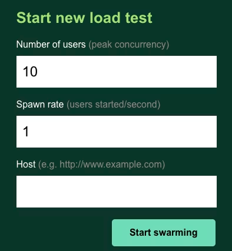
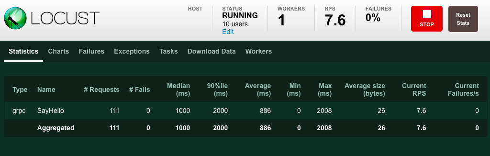
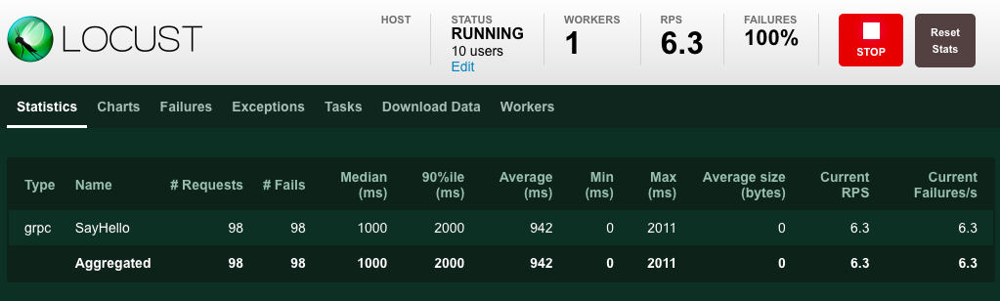
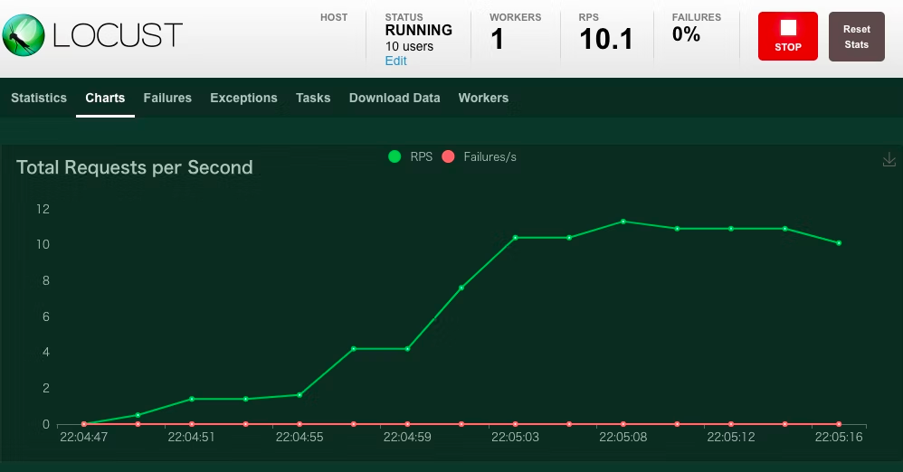

### 编译 server和boomer

```shell
$ go build -o server ./cmd/server/main.go
$ go build -o boomer ./cmd/boomer/main.go

```

#### 启动服务器

```
./server
```

### 启动 boomer

```
./boomer
```

### 启动 locust

```
brew install locust
locust --master -f dummy.py
```

### 打开监控界面

```
http://0.0.0.0:8089
```

### 截图





